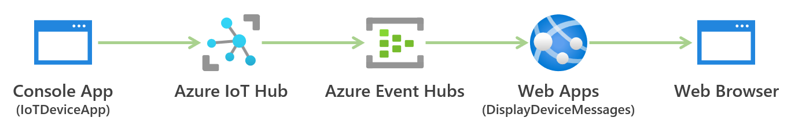

# このリポジトリについて
Azure IoT Hub の環境をサクッと構築するためのコードです。デプロイを行うことで、以下のことを行います。

- 以下の Azure リソースの作成
  - Azure IoT Hub
  - Azure Storage
  - Azure Event Hubs
  - Azure Web Apps
- Azure IoT Hub へのデバイスの登録
- Azure Web Apps への Azure IoT Hub へ送られたメッセージをリアルタイムで確認するための Web アプリケーション(DisplayDeviceMessages)のデプロイ

# クラウドアーキテクチャ


# 使用するのに必要なもの
- [.NET 5 Runtime](https://dotnet.microsoft.com/en-us/download/dotnet/5.0)
- [Azure CLI](https://docs.microsoft.com/ja-jp/cli/azure/install-azure-cli)

# 使用方法

## デプロイ
以下のコマンドを実行して、環境をデプロイしてください。

```sh
deploy.sh
```

## IoT デバイスプログラムの起動
以下のコマンドを実行して、デプロイした Azure IoT Hub リソースに対して、登録したデバイスとして1秒間隔でメッセージを送信するプログラムを起動してください。

```sh
cd IoTDeviceApp
dotnet run
```

## IoT Hub に送られたデバイスメッセージの確認
デプロイ後に表示された URL へアクセスして、IoT デバイスプログラムから Azure IoT Hub へ送られたメッセージを確認します。

```
Please access to https://{作成された Azure IoT Hub の名前}.azurewebsites.net/index.html to watch messages Azure IoT Hub received.
```
